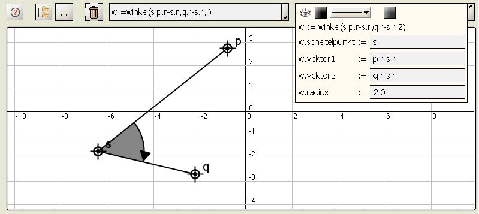

math4u2 -  Ein Bild sagt mehr als tausend Formeln?
=======

Natürlich nicht!  Aber manchmal  ist es schon sehr hilfreich, wenn die Aussage einer mathematischen Formel oder Idee mit einem prägnanten Bild oder einer Bildsequenz  noch verständlicher gemacht wird.

Das Projekt beschäftigt sich im Kern mit dem Versuch, die Idee eines  bild-gestützten mathematischen Argumentierens in eine virtuelle Umgebung zu transportieren - natürlich sollen sich die Ergebnisse auch als Bausteine in traditionellen Vorlesungen nutzen lassen.

Die Impulse dazu kamen von der Lehre im Fach Mathematik in verschiedenen technischen Studiengängen. Der Einsatz in  diesen Vorlesungen hat die Entwicklung der Funktionalität und die Erstellung der Lektionen entscheidend beeinflusst.

Entstanden ist math4u2:
- Kleine Modelle können mit math4u2 in einer Vorlesung schnell interaktiv aufgebaut und sofort interaktiv "erforscht" werden. Die Ergebnisse können abgespeichert, per Web verteilt und wieder in math4u2 geladen werden.
- Größere Modelle oder Argumentationssequenzen (Lektionen) werden mit Hilfe spezieller XML-Dokumente beschrieben und laufen beim Benutzer dann schrittweise, gegebenenfalls mit Animation, ab. Der Benutzer kann die Modelle jederzeit interaktiv verändern.
- Ein math4u2-Server erlaubt den Abruf eines Inhaltsverzeichnisses und von einzelnen Lektionen direkt vom math4u2-Tool aus.
Das System ist komplett in Java implementiert: Parser(yavacc), mathematischer Kern,  Analyse von Abhängigkeiten so, dass Änderungen nur einmal und nur zu  abhängigen Komponenten propagiert  werden, Darstellung von Formeln und Texten, parsen von XML-Dateien mittels pull-Parser, besondere Funktionen oder Graphiken können via Javassist  direkt in Java implementiert werden. 

**An der aktuell vorliegenden Version 2.3.1 haben mitgearbeitet:**
- Prof. Dr. Max Weiß: Initiative, Koordination, mathematischer Kern, Lektionen
- Stefan Fenn, Dipl. Inf. (FH) : Framework, graphische Oberfläche, Optimierung, Installation
- Michael Lichtenstern, Dipl. Inf (FH) : Webdesign, Serveranbindung
- Erich Seifert, Dipl. Inf (FH) : XML-Konzept, Formelsatz, Swing-Programmierung
- Christoph Beckmann, Dipl. Inf (FH) : Script-Parser, Formelsatz-Parser

**Projekt**:

Start im Herbst 2001, im Zeitraum 2001 bis 2004 gefördert durch das  Programm zur Förderung der Weiterentwicklung von Hochschule und (HWP).

Mathematischer Kern:
=======

Der mathematische Kern deckt mit der üblichen Term-Syntax folgende Gebiete ab:

**Analysis:**
Funktionen mit einer oder mehreren Veränderlichen, Ableitung

**Lineare Algebra:**
Matrizen und Vektoren, Determinante, inverse Matrix, Lösung von linearen Gleichungssystemen mit regulärer Koeffizientenmatrix

**Geometrie:**
Punkt, Strecke, Gerade, Kreis und Winkel, parametrisierte Kurven und Kurvenzüge.

